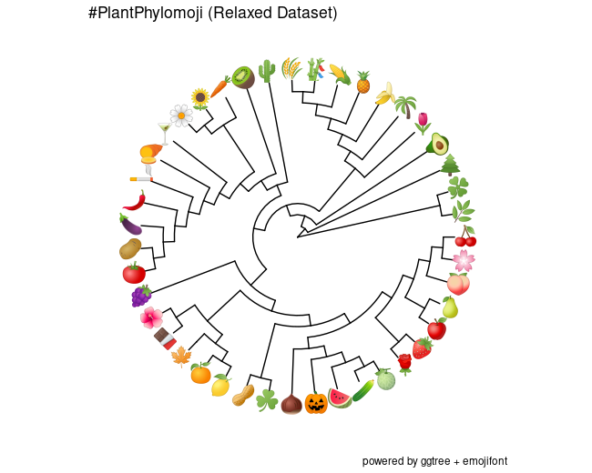
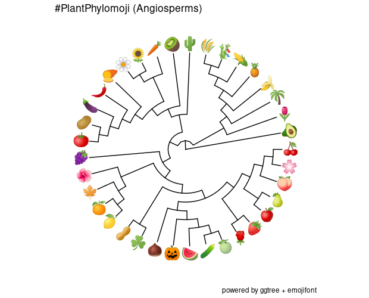
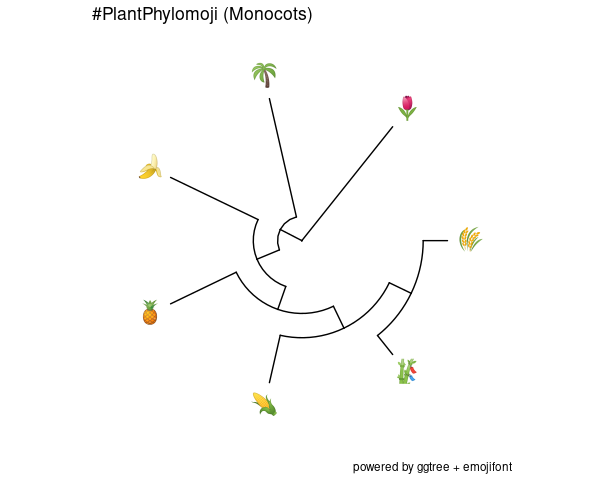
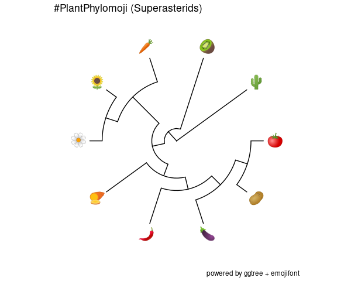
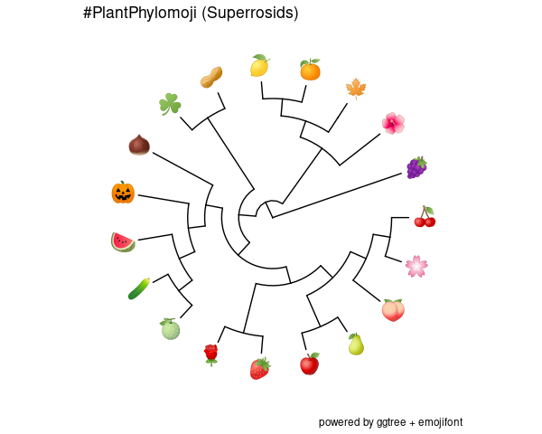
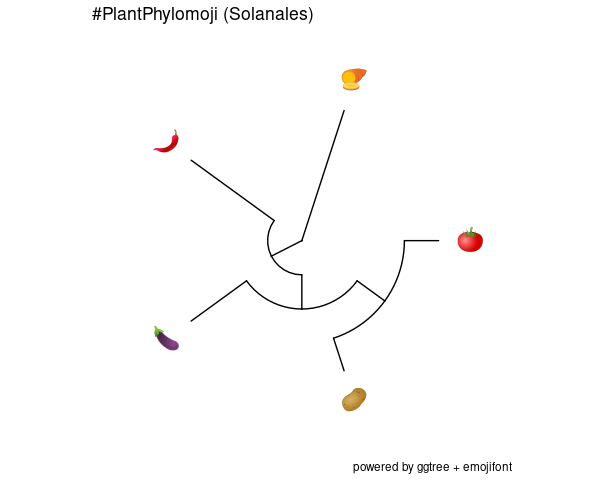

#PlantPhylomoji Dataset

The plant phylomoji dataset features the following plant species: 

| Name            | Emoji | Emoji text code  | Species                  |
|-----------------|-------|------------------|--------------------------|
| Apple           | 🍎     | apple            | *Malus domestica*        |
| Avocado         | 🥑     | avocado          | *Persea americana*       |
| Bamboo          | 🎋     | tanabata_tree    | *Phyllostachys*          |
| Banana          | 🍌     | banana           | *Musa x paradisiaca*     |
| Carrot          | 🥕     | carrot           | *Daucus carota*          |
| Cherry          | 🍒     | cherries         | *Prunus avium*           |
| Chestnut        | 🌰     | chestnut         | *Castanea dentata*       |
| Chili Pepper    | 🌶️     | hot_pepper       | *Capsicum annuum*        |
| Chocolate       | 🍫     | chocolate_bar    | *Theobroma cacao*        |
| Clover          | ☘️     | shamrock         | *Trifolium*              |
| Corn            | 🌽     | corn             | *Zea mays*               |
| Cucumber        | 🥒     | cucumber         | *Cucumis sativus*        |
| Daisy           | 🌼     | blossom          | *Bellis perennis*        |
| Eggplant        | 🍆     | eggplant         | *Solanum melongena*      |
| Fern            | 🌿     | herb             | *Mickelia*               |
| Grapes          | 🍇     | grapes           | *Vitis vinifera*         |
| Hibiscus        | 🌺     | hibiscus         | *Hibiscus rosa-sinensis* |
| Japanese Cherry | 🌸     | cherry_blossom   | *Prunus x yedoensis*     |
| Kiwi            | 🥝     | kiwi_fruit       | *Actinidia deliciosa*    |
| Lemon           | 🍋     | lemon            | *Citrus × limon*         |
| Maple           | 🍁     | maple_leaf       | *Acer*                   |
| Melon           | 🍈     | melon            | *Cucumis melo*           |
| Olive           | 🍸️     | cocktail         | *Olea europaea*          |
| Palm            | 🌴     | palm_tree        | *Cocos nucifera*         |
| Peach           | 🍑     | peach            | *Prunus persica*         |
| Peanuts         | 🥜     | peanuts          | *Arachis hypogaea*       |
| Pear            | 🍐     | pear             | *Pyrus malus*            |
| Pine            | 🌲     | evergreen_tree   | *Pinus*                  |
| Pineapple       | 🍍     | pineapple        | *Ananas comosus*         |
| Potato          | 🥔     | potato           | *Solanum tuberosum*      |
| Pumpkin         | 🎃     | jack_o_lantern   | *Cucurbita maxima*       |
| Rice            | 🌾     | ear_of_rice      | *Oryza sativa*           |
| Rose            | 🌹     | rose             | *Rosa*                   |
| Saguaro         | 🌵     | cactus           | *Carnegiea gigantea*     |
| Strawberry      | 🍓     | strawberry       | *Fragaria vesca*         |
| Sunflower       | 🌻     | sunflower        | *Helianthus annuus*      |
| Sweet potato    | 🍠     | sweet_potato     | *Ipomoea batatas*        |
| Tangerine       | 🍊     | tangerine        | *Citrus reticulata*      |
| Tobacco         | 🚬     | smoking          | *Nicotiana tabacum*      |
| Tomato          | 🍅     | tomato           | *Solanum lycopersicum*   |
| Tulip           | 🌷     | tulip            | *Tulipa*                 |
| Water Clover    | 🍀     | four_leaf_clover | *Marsilea*               |
| Watermelon      | 🍉     | watermelon       | *Citrullus lanatus*      |

# Complete Strict 

This is the original dataset. The parenthetical phylogeny includes Mangoes and Lettuce but they aren't rendered in ggtree.

( 🌲,( 🥑,(( 🌷, ( 🌴, ( 🍌, ( 🍍, ( 🌽, ( 🎋, 🌾 )))))),(( 🍇, ((( 🥜, ☘️), ((( 🌹, 🍓 ), (( 🍎, 🍐 ), ( 🍑, (🌸, 🍒) ))), ( 🌰, ( 🎃, ( 🍉, ( 🥒, 🍈)))))), (( 🌺, 🥦 ), (( 🍊, 🍋 ), ( 🍁, 🥭))))),( 🌵, ( 🥝, (( 🍠, ( 🌶️, (🍆, ( 🥔, 🍅)))), ( 🥕,( 🥬, ( 🌻, 🌼)))))))))

 

# Complete Relaxed

This dataset includes emojis of plant byproducts, and other emojis with an unclear ID. 
🍀= *Marsilea*,  🍫 = *Theobroma* and  🚬 = *Nicotiana*

(( 🌿, 🍀),( 🌲,( 🥑,(( 🌷, ( 🌴, ( 🍌, ( 🍍, ( 🌽, ( 🎋, 🌾 )))))),(( 🍇, ((( 🥜, ☘️), ((( 🌹, 🍓 ), (( 🍎, 🍐 ), ( 🍑, ( 🌸, 🍒) ))), ( 🌰, ( 🎃, ( 🍉, ( 🥒, 🍈)))))), ((🥦, ( 🌺, 🍫)), (( 🍊, 🍋 ), (🍁,🥭))))),( 🌵, ( 🥝,(( 🍸️, ( 🍠, ( 🚬,( 🌶️, ( 🍆, ( 🥔, 🍅)))))), ( 🥕,( 🥬, ( 🌻, 🌼))))))))))

 

Additional examples:

# Angiosperms only

( 🥑,(( 🌷, ( 🌴, ( 🍌, ( 🍍, ( 🌽, ( 🎋, 🌾 )))))),(( 🍇, ((( 🥜, ☘️), ((( 🌹, 🍓 ), (( 🍎, 🍐 ), ( 🍑, (🌸, 🍒) ))), ( 🌰, ( 🎃, ( 🍉, ( 🥒, 🍈)))))), (( 🌺, 🥦 ), (( 🍊, 🍋 ), ( 🍁, 🥭))))),( 🌵, ( 🥝, (( 🍠, ( 🌶️, (🍆, ( 🥔, 🍅)))), ( 🥕,( 🥬, ( 🌻, 🌼)))))))) 

 

# Monocots

( 🌷, ( 🌴, ( 🍌, ( 🍍, ( 🌽, ( 🎋, 🌾 )))))) 

 

# Superasterids

( 🌵, ( 🥝, (( 🍠, ( 🌶️, ( 🍆, ( 🥔, 🍅)))), ( 🥕,( 🌻, 🌼))))) 

 

# Superrosids

( 🍇, ((( 🥜, ☘️), ((( 🌹, 🍓 ), (( 🍎, 🍐 ), ( 🍑, ( 🌸, 🍒) ))), ( 🌰, ( 🎃, ( 🍉, ( 🥒, 🍈)))))), (( 🌺, 🥦 ), (( 🍊, 🍋 ), ( 🍁,🥭 )))))

 

# Solanales

( 🍠, ( 🌶️, ( 🍆, ( 🥔, 🍅)))))

 

 References: 
 Chase, M. W., Christenhusz, M. J. M., Fay, M. F., Byng, J. W., Judd, W. S., Soltis, D. E., ... & Stevens, P. F. (2016). An update of the Angiosperm Phylogeny Group classification for the orders and families of flowering plants: APG IV. Botanical Journal of the Linnean Society, 181(1), 1-20.
 
 Kocyan, A., Zhang, L. B., Schaefer, H., & Renner, S. S. (2007). A multi-locus chloroplast phylogeny for the Cucurbitaceae and its implications for character evolution and classification. Molecular phylogenetics and evolution, 44(2), 553-577.
 
 Särkinen, T., Bohs, L., Olmstead, R.G. et al. A phylogenetic framework for evolutionary study of the nightshades (Solanaceae): a dated 1000-tip tree. BMC Evol Biol 13, 214 (2013). https://doi.org/10.1186/1471-2148-13-214.
 
 Soreng, R. J., Peterson, P. M., Romaschenko, K., Davidse, G., Teisher, J. K., Clark, L. G., ... & Zuloaga, F. O. (2017). A worldwide phylogenetic classification of the Poaceae (Gramineae) II: An update and a comparison of two 2015 classifications. Journal of Systematics and Evolution, 55(4), 259-290.
 
 Xiang, Y., Huang, C. H., Hu, Y., Wen, J., Li, S., Yi, T., ... & Ma, H. (2017). Evolution of Rosaceae fruit types based on nuclear phylogeny in the context of geological times and genome duplication. Molecular Biology and Evolution, 34(2), 262-281.
 
 Yu, Guangchuang, David Smith, Huachen Zhu, Yi Guan, and Tommy Tsan-Yuk Lam. 2017. “Ggtree: An R Package for Visualization and Annotation of Phylogenetic Trees with Their Covariates and Other Associated Data.” Methods in Ecology and Evolution 8 (1): 28–36. doi:10.1111⁄2041-210X.12628.

