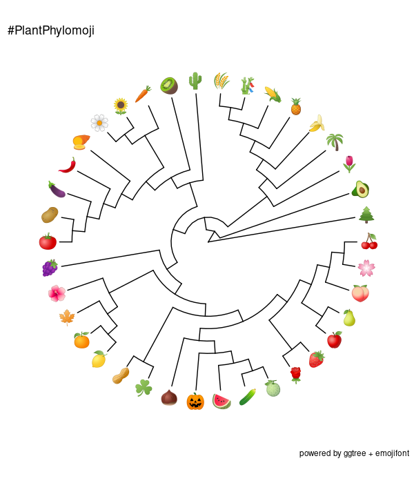

# PlantPhylomoji : A phylogenetic tree of plant emojis

 This github repository features a dataset and scripts to produce a phylogeny of plants represented by ideograms.
  
  The general objective of this project is to provide a resource for teachers, students, and researchers interested in phylogenetic trees and plant evolution.
 
  
  
  

   [PlantPhylomoji R Script](./PlantPhylomoji.R)   
   Script to plot PlantPhylomoji trees using R.

   [PlantPhylomoji Dataset](./Dataset.md)   
   Information about the dataset, trees, additional images & references.

   [PlantPhylomoji tutorial on Jupyter](./PlantPhylomoji.ipynb)  
  Tutorial to plot PlantPhylomoji trees using R & Jupyter.
   WORK IN PROGRESS

   [PlantPhylomoji Development Log](./PlantPhylomojiLog.md)   
   Log and future ideas for this repo
 
 Featured in : 
 Escudero, M., & Wendel, J. F. The grand sweep of chromosomal evolution in angiosperms. New Phytologist.  doi: [10.1111/nph.16668.](https://nph.onlinelibrary.wiley.com/doi/abs/10.1111/nph.16802)
 
  You may also like:
  Mammola, S., Falaschi, M., & Ficetola, G. F. (2023). Biodiversity communication in the digital era through the Emoji tree of life. Iscience, 26(12). doi: [10.1016/j.isci.2023.108569](https://www.sciencedirect.com/science/article/pii/S2589004223026469)
  
  Github user Matad0n has created a new repository with an updated version of plant emojis. Check it out! [REmojiTree](https://github.com/Matad0n/REmojiTree/tree/main)
