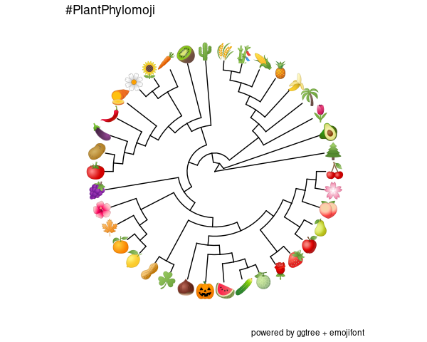

# #PlantPhylomoji : A phylogenetic tree of plant emojis

 This github repository features a dataset and scripts to produce a phylogeny of plants represented by ideograms.
  
  The general objective of this project is to provide a resource for teachers, students, and researchers interested in phylogenetic trees and plant evolution.
 
  
  

  
 

   [Plant Phylomoji Dataset](./Dataset.md)
   
   Information about the dataset, subsets, references.

   [Plant Phylomoji R Script](./PlantPhylomoji.R)
   
   Script to reproduce PlantPhylomoji tree and alternative datasets using R.
   
  [Plant Phylomoji on Jupyter](./PlantPhylomoji.ipynb)
  
  Script to reproduce PlantPhylomoji tree and alternative datasets using R & Jupyter notebook.

   [Plant Phylomoji Development Log](./PlantPhylomojiLog.md)
   
   Log and future ideas for this repo
 
 WORK IN PROGRESS
 
 Featured in :
 
 Escudero, M., & Wendel, J. F. The grand sweep of chromosomal evolution in angiosperms. New Phytologist.
 doi: [10.1111/nph.16668.](https://nph.onlinelibrary.wiley.com/doi/abs/10.1111/nph.16802)
  