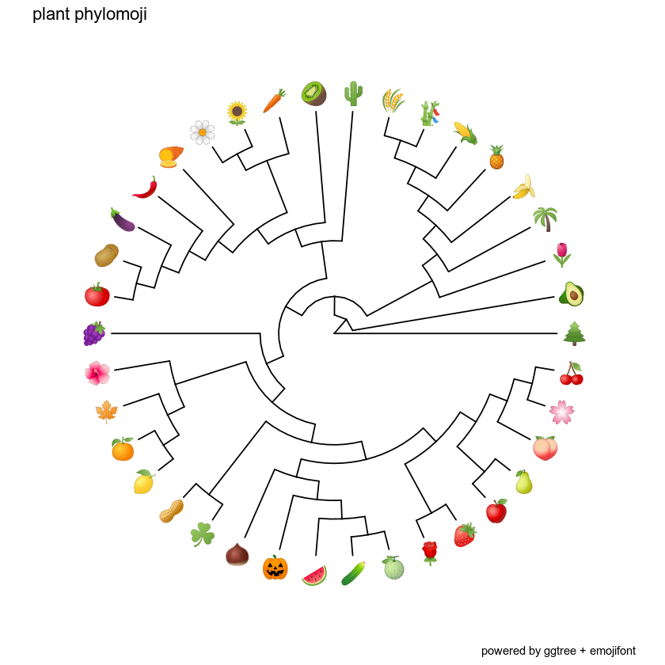

# GitHub Repository for the Phylogeny of Plant Emojis

  This repository features a dataset and scripts to produce a phylogeny of plants represented by ideograms.
  
  

 

   [Plant Phylomoji Dataset](https://github.com/ghuertaramos/PlantPhylomoji/blob/master/Dataset.md)

   [Plant Phylomoji R Script](https://github.com/ghuertaramos/PlantPhylomoji/blob/master/PlantPhylomoji.R)
   
  [Plant Phylomoji on Jupyter](https://github.com/ghuertaramos/PlantPhylomoji/blob/master/PlantPhylomoji.ipynb)

   [Plant Phylomoji Development Log](https://github.com/ghuertaramos/PlantPhylomoji/blob/master/PlantPhylomoji.md)

 The general objective of this project is to generate teaching material in the topics of evolution and systematics. 
 
 Particularly, I want to provide figures to help undergrad students to understand concepts about phylogenetic trees.  Moreover, I want to write a series of tutorials on tree manipulation using this dataset on R
  
 
 WORK IN PROGRESS
  
 References: 
 Chase, M. W., Christenhusz, M. J. M., Fay, M. F., Byng, J. W., Judd, W. S., Soltis, D. E., ... & Stevens, P. F. (2016). An update of the Angiosperm Phylogeny Group classification for the orders and families of flowering plants: APG IV. Botanical Journal of the Linnean Society, 181(1), 1-20.
 
 Yu, Guangchuang, David Smith, Huachen Zhu, Yi Guan, and Tommy Tsan-Yuk Lam. 2017. “Ggtree: An R Package for Visualization and Annotation of Phylogenetic Trees with Their Covariates and Other Associated Data.” Methods in Ecology and Evolution 8 (1): 28–36. doi:10.1111⁄2041-210X.12628.
